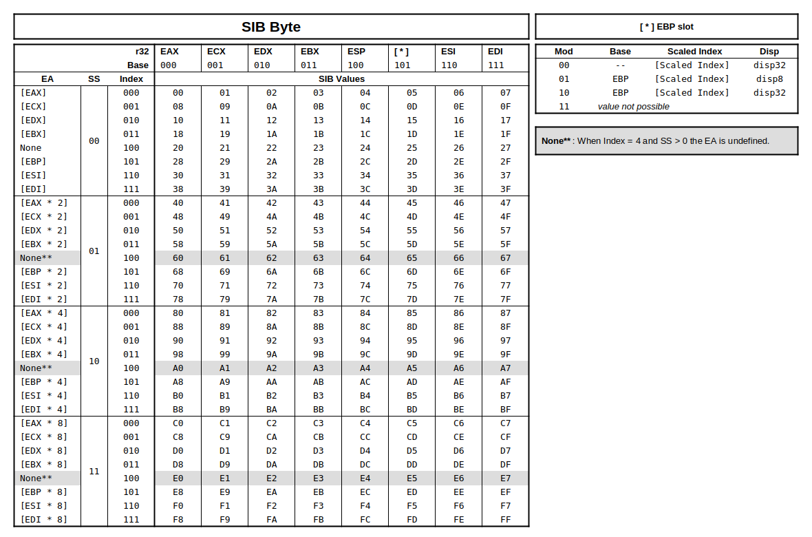

# test386.asm

test386.asm is a 80386 or later CPU tester, written for the 
[NASM](http://www.nasm.us/) assembler. It runs as a BIOS replacement and does
not depend on any OS or external library.

test386.asm communicates with the external world through the diagnostic POST I/O
port and the parallel and/or serial ports. You'll need to configure the
addresses of these ports for the system you're testing.

**WARNING**: this program is designed for emulators and was never tested on real
hardware. Use at your own risk.

## Project status

Please note that in the current version, test386.asm is still **incomplete** and
is not able to test every functionality of a CPU. It will probably not detect
that bug that is keeping you up at night, sorry.

For the full list of tested opcodes see **`intel-opcodes.ods`**.
Those opcodes that are tested have the relevant diagnostic code in the "test in
real mode" and/or "test in prot. mode" columns.  
Besides the specific opcodes reported in the opcodes list file, other aspects of
the x86 architecture are only partially tested or not tested at all:

  - no virtual-8086 mode testing
  - no task management testing
  - partial testing of user mode (ring 3) operations
  
Also, even if the program can run on any x86 32-bit compatible CPU, its testing
routines are limited to the functionality of the intel 80386 processor family.

### Realistic expectations

Total correctness depends on termination and there is no general solution
to the [halting problem](https://en.wikipedia.org/wiki/Halting_problem). 

That being said, and even aiming at partial correctness, the x86 architecture is
so complex (and the input domain so vast) that the probability of reaching a
good level of testing coverage, enough to declare a CPU implementation as bug
free (for some definition of "free"), is close to 0.  

Judging from the amount of errata that follow a CPU product launch, not even the
CPU manufacturers are capable of such a feat, despite their infinite amount of
engeenering resources.

Nonetheless I hope you'll find this program useful (and correct) enough to be
added to your unit tests and worthy to be used alongside tools like
[s a n d s i f t e r](https://github.com/xoreaxeaxeax/sandsifter).  

## How to assemble

First of all grab the NASM assembler from http://www.nasm.us/ and follow its
installation instructions.

Then open `src/configuration.asm` and configure the EQUs with suitable
values for your system.

A diagnostic code will be output to the configured POST port. Computation
results in the form of ASCII messages will also be output to LPT, COM, and/or
custom OUT ports, whichever is enabled and configured.
See the `src/configuration.asm` file for information on how to configure
the program's output.

If you're in a UNIX environment you can then use:
```
$ make
```

Otherwise use a command line like this one:
```
nasm -i./src/ -f bin src/test386.asm -l test386.lst -o test386.bin
```

Any multiple `(testBCD:19) unterminated string` warnings can be ignored.

The final product is a binary file named **`test386.bin`** of exactly
65,536 bytes.

## How to install

The binary assembled file must be installed at physical address 0xf0000 and
aliased at physical address 0xffff0000.  The jump at resetVector should align
with the CPU reset address 0xfffffff0, which will transfer control to f000:0045.
All memory accesses will remain within the first 1MB.

## How to use

Once the system is powered on, testing starts immediately and after a while
you should get the `0xFF` POST code. In case of error the program will
execute an HLT instruction and the diagnostic code will tell you the test that
failed.  
If the program restarts itself automatically, in an apparently infinite loop,
that's a possible buggy stack management, or a problem with CALL/RET execution.

In any case, your emulator should have a logging facility; use its output to
inspect the instruction execution flow and determine the exact cause of the
problem.

An inportant piece of information, useful as a diagnostic guide, is the
intermediate source-listing file **`test386.lst`**, that is produced by
NASM during assembly (assuming it's enabled with the `-l` switch).
Once you determine the EIP value at which a problem arised, look it up in
`test386.lst`, on the second column; you'll have a clearer picture of
what the program was trying to do.

This is the list of tests with their diagnostic code:

| POST | Description                                                        |
| ---- | ------------------------------------------------------------------ |
| 0x00 | Real mode initialisation                                           |
| 0x01 | Conditional jumps and loops                                        |
| 0x02 | Quick tests of unsigned 32-bit multiplication and division         |
| 0x03 | Move segment registers in real mode                                |
| 0x04 | Store, move, scan, and compare string data in real mode            |
| 0x05 | Calls in real mode                                                 |
| 0x06 | Load full pointer in real mode                                     |
| 0x08 | GDT, LDT, PDT, and PT setup, enter protected mode                  |
| 0x09 | Stack functionality *                                              |
| 0x0A | Test user mode (ring 3) switching                                  |
| 0x0B | Moving segment registers                                           |
| 0x0C | Zero and sign-extension                                            |
| 0x0D | 16-bit addressing modes (LEA)                                      |
| 0x0E | 32-bit addressing modes (LEA) *                                    |
| 0x0F | Access memory using various addressing modes                       |
| 0x10 | Store, move, scan, and compare string data in protected mode       |
| 0x11 | Page faults and PTE bits                                           |
| 0x12 | Other memory access faults                                         |
| 0x13 | Bit Scan operations                                                |
| 0x14 | Bit Test operations                                                |
| 0x15 | Byte set on condition (SETcc)                                      |
| 0x16 | Calls in protected mode                                            |
| 0x17 | Adjust RPL Field of Selector (ARPL)                                |
| 0x18 | Check Array Index Against Bounds (BOUND)                           |
| 0x19 | Exchange Register/Memory with Register (XCHG)                      |
| 0x1A | Make Stack Frame for Procedure Parameters (ENTER)                  |
| 0x1B | High Level Procedure Exit (LEAVE)                                  |
| 0x1C | Verify a Segment for Reading or Writing (VERR/VERW)                |
| 0xE0 | Undefined behaviours and bugs (CPU family dependent) *             |
| 0xEE | Series of unverified tests for arithmetical and logical opcodes ** |
| 0xFF | Testing completed                                                  |

\* These tests are affected by undefined behaviour. See below.

\** Test `0xEE` always completes successfully. It will print its computational
ASCII results to the configured output ports.

Once you reach POST 0xFF, you need to check the results of POST 0xEE with the
provided reference.  
POST 0xEE executes a series of arithmetic and logical operations that affect the
CPU's status flags. None of those operations is checked for correctness during
execution.

Assuming your ouput file is called `my-EE-output.txt`, compare it with 
 **`test386-EE-reference.txt`** using a command like:

```
$ diff my-EE-output.txt test386-EE-reference.txt
```
Under Windows, use whatever diff-like tool you prefer.

Every line of `test386-EE-reference.txt` is composed of:
  - operation opcode
  - operation mnemonic
  - operands size: B=byte, W=word, D=double word
  - EAX value before and after execution; it's the value of the destination
  operand, even if it's not EAX
  - EDX value before and after execution; it's the value of the source operand,
  even if it's not EDX; for shifts and rotates it's the amount; for arithmetic
  ops with an immediate it's the value of the immediate
  - PS value before and after execution; it's the value of the processor status
  register, but only for the flags defined for the operation; undefined flags
  are masked out

Use `test386.lst` and your emulator's logs as a guide to determine
instruction and cause of any possible difference.

Remember that test386.asm is open-source. Take advantage of this and read the
source code and its comments to know what's really going on. The entry point,
you guessed it, is in `src/test386.asm`.

### Undefined Behaviour

Undefined behaviour affects many tested instructions but is specifically avoided
unless the `TEST_UNDEF` equ is set to `1`.

*Note:* this is what UB is tested in test386.asm, not a complete list of all the
known UB in Intel CPUs.

| Instruction       | Test | Undefined behaviour tested                    |
| ----------------- | ---- | --------------------------------------------- |
| PUSH              | 0x09 | Value of MSW on stack after push of 16-bit SR |
| POPAD             | 0x09 | Value of MSW of ESP after execution           |
| LEA (32-bit addr) | 0x0E | EA of SIB values with no Index and SS > 0     |
| AAA               | 0xE0 | Flags `OF`, `SF`, `ZF`, `PF`                  |
| AAD               | 0xE0 | Flags `CF`, `OF`, `AF`                        |
| AAM               | 0xE0 | Flags `CF`, `OF`, `AF`                        |
| AAS               | 0xE0 | Flags `OF`, `SF`, `ZF`, `PF`                  |
| DAA, DAS          | 0xE0 | Flag `OF`                                     |
| SHR               | 0xE0 | Flags `CF`, `OF`, `AF`                        |
| SHL / SAL         | 0xE0 | Flags `CF`, `OF`, `AF`                        |
| BT, BTC, BTR, BTS | 0xE0 | Flag `OF`                                     |
| RCR, RCL          | 0xE0 | Flags `CF`, `OF`                              |

#### PUSH

With 32-bit PUSH of a 16-bit segment selector, i386 and i486 CPUs perform a
16-bit move, leaving the upper portion of the stack location unmodified.

This behaviour is not specified in the manuals of older CPUs and is cited in
recent manuals like this:

"If the source operand is a segment register (16 bits) and the operand
size is 32-bits, either a zero-extended value is pushed on the stack or
the segment selector is written on the stack using a 16-bit move. For the
last case, all recent Core and Atom processors perform a 16-bit move,
leaving the upper portion of the stack location unmodified."

#### POPAD

With a 16-bit stack address size:

 * i386 and i486 manuals state a Pop() for `ESP` is performed, but the value is
 discarded.
 * starting from the Pentium manuals state `ESP` is not popped from the stack
 and `SP` value is incremented by 4 instead.

For the i386, the actual behaviour is a Pop() operation is performed and the
double-word value is loaded into `ESP`, then the LSW is overwritten with the
actual value of `SP` while the MSW is left unchanged.

If `TEST_UNDEF` is enabled, test `0x09` will fail if the MSW of `ESP` won't
contain the value on the stack for ESP.

#### LEA (32-bit addressing)

Three entire rows of the SIB table - presented in Intel 386 manuals without
comment - are actually invalid. These rows are shown in the following table
shaded in gray.

[](./img/sib_table.png)

On the i386, when the `Index` field of the SIB byte is `4` (`100b`) and the `SS`
field is not `0`, the scale factor is applied to the base register.

If `TEST_UNDEF` is enabled, test `0x0E` will test SIB values in the ranges
`60-67`, `A0-A7`, and `E0-E7`.

#### AAA

Intel's IA-32 manual states that only `AF` and `CF` are valid. Undefined flags
`OF`, `SF`, `ZF`, and `PF` are actually updated in a way that depends on the CPU
family.

This is the instruction for the i386:

```
SF := (AL >= 0x7A) and (AL <= 0xF9);
IF ((AL & 0x0F) > 9)
	OF := (AL & 0xF0) = 0x70;
	AX := AX + 0x106;
	ZF := AL = 0;
	CF := 1;
	AF := 1;
ELSE IF (AF = 1)
	AX := AX + 0x106;
	ZF := 0;
	OF := 0;
	CF := 1;
	AF := 1;
ELSE
	ZF := AL = 0;
	OF := 0;
	CF := 0;
	AF := 0;
PF := PARITY(AL);
AL := AL & 0x0F;
```

#### AAD

On the i386 undefined flags `CF`, `OF`, and `AF` are set in the same way of the
ADD byte instruction.

#### AAM

On the i386 undefined flags `CF`, `OF`, and `AF` are all cleared.

#### AAS

Flags `OF`, `SF`, `ZF`, and `PF` are considered undefined but they're updated in
a way that depends on the CPU family.

This is the instruction for the i386:

```
IF ((AL & 0x0F) > 9)
	SF := AL > 0x85;
	AX := AX - 0x106;
	OF := 0;
	CF := 1;
	AF := 1;
ELSE IF (AF = 1)
	OF := (AL >= 0x80) and (AL <= 0x85);
	SF := (AL < 0x06) or (AL > 0x85);
	AX := AX - 0x106;
	CF := 1;
	AF := 1;
ELSE
	SF := AL >= 0x80;
	OF := 0;
	CF := 0;
	AF := 0;
END IF
ZF := AL = 0;
PF := PARITY(AL);
AL := AL & 0x0F;
```

#### DAA, DAS

On the i386 undefined flag `OF` is set according to the result of the operation.

#### SHR

On the i386 _undefined_ flags are as follows.

Byte operand:

```
IF (ShiftAmt > 0)
	AF := 1
	IF (ShiftAmt = 8 or ShiftAmt = 16 or ShiftAmt = 24)
		CF := MSB(operand)
		OF := 0
	ELSE IF (ShiftAmt > 8)
		CF := 0
		OF := 0
	ELSE /* ShiftAmt between 1 and 7 */
		CF := according to result
		OF := according to result
	END IF
END IF
```

Word operand:

```
IF (ShiftAmt > 0)
	AF := 1
	CF := according to result
	OF := according to result
END IF
```

#### SHL / SAL

On the i386 _undefined_ flags are as follows.

Byte operand:

```
IF (ShiftAmt > 0)
	AF := 1
	IF (ShiftAmt = 8 or ShiftAmt = 16 or ShiftAmt = 24)
		CF := LSB(operand)
		OF := CF
	ELSE IF (ShiftAmt > 8)
		CF := 0
		OF := 0
	ELSE /* ShiftAmt between 1 and 7 */
		CF := according to result
		OF := according to result
	END IF
END IF
```

Word operand:

```
IF (ShiftAmt > 0)
	AF := 1
	IF (ShiftAmt = 16)
		CF := LSB(operand)
		OF := CF
	ELSE IF (ShiftAmt > 16)
		CF := 0
		OF := 0
	ELSE /* ShiftAmt between 1 and 15 */
		CF := according to result
		OF := according to result
	END IF
END IF
```

#### BT, BTC, BTR, BTS

On the i386, undefined flag `OF` is set the same as RCR with initial `CF` value
of `0`.

#### RCR, RCL

On the i386, flags `CF` and `OF` are set to `1` when `COUNT = 9` (byte operand)
and `COUNT = 17` (word operand).

### Comparing memory dumps

The execution of test386.asm is deterministic. This means that, at POST FFh, the
program results in the same RAM content every time it's executed.

If you have a known working emulator that you trust (preferably open-source),
you can compare its memory dump with yours.

**Note**: unless you know what you're looking for, Undefined Behaviour testing
should be disabled before comparing memory dumps by setting TEST_UNDEF equ to 0.

In the following example I'll use **Bochs** as a reference.  
**Beware**: this is just an example, I cannot guarantee that Bochs is bug free.

I'll use commands and tools commonly found in Linux and other UNIX-like systems.
I'm sure you can find similar tools for Windows, possibly with a GUI. 

In Bochs' debugger, use the `writemem` command to dump the first 640K of
memory:

```
writemem "bochs-640k-memdump.bin" 0 655360
```

Then do the same in your emulator producing a file named
`my-640k-memdump.bin`.

If you can't dump the first 640K precisely, you can use this command to trim a
bigger dump:

```
$ dd if=my-big-memdump.bin of=my-640k-memdump.bin bs=655360 count=1
```

Now do a binary compare of the two dumps. In order for it to be useful, for
every difference detected it should show the byte offset and the values that
differ, possibly in hex and/or octal forms.

You can use a combination of `cmp` and `gawk`:

```
$ cmp -l my-640k-memdump.bin bochs-640k-memdump.bin | gawk '{printf "%08X %02X %02X\n", ($1-1), strtonum(0$2), strtonum(0$3)}'
```

This is a possible output (the actual output of a comparison between my buggy
emulator with Bochs):

```
00002008 27 67
000023C4 27 67
```

First column: the byte offset  
Second column: the value in my-640k-memdump.bin  
Third column: the value in bochs-640k-memdump.bin

To roughly determine what's the memory area used for, compare your offsets with
the current memory map of test386.asm, reported at the top of the 
`src/test386.asm` file.

In this example, there's a problem in the way the emulator updates a PTE and in
particular the Dirty bit.

To see what's going on, use your emulator's memory traps functionality and
define a read/write trap, in this example at dword 0x2008.  
Doing so you'll quickly see who's doing what and where.  
Again, use the EIP that you determined with the trap to look up the instruction
in `test386.lst`

Good luck.


## Copyright

test386.asm was originally developed for
[IBMulator](http://barotto.github.io/IBMulator)
starting as a derivative work of
[PCjs](http://pcjs.org).

Distributed under the GNU General Public License as published by the Free
Software Foundation, either version 3 of the License, or (at your option) any 
later version.

